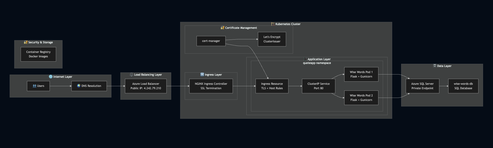
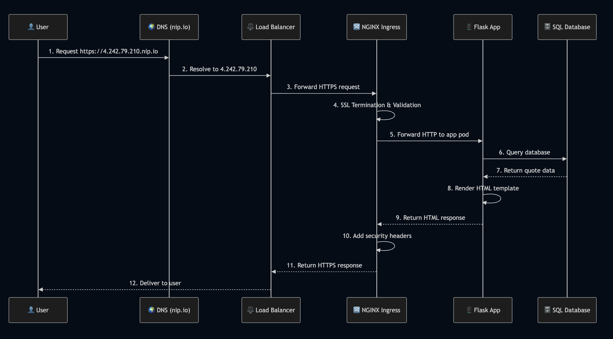

# Wise Words on Demand

A simple web application that fetches quotes from azure sql databases, built with Flask and deployed on Azure Kubernetes Service (AKS).

## 🌟 Features

- **Random Quote Display**: Get inspired with randomly selected quotes on the homepage
- **Quote Injection**: Bulk import additional quotes to expand the database
- **Health Monitoring**: Built-in health checks for application and database status

## 🏗️ Architecture Overview

The application is deployed on Azure Kubernetes Service (AKS) with a modern, scalable architecture:



## Application flow:

Flow of the application:



*Detailed architecture diagram showing the complete solution including Azure services, Kubernetes components, networking, and data flow.*

## 🚀 How to Test the App Locally

### Prerequisites

- Python 3.8+ installed
- SQL Server or SQLite database
- Git (for cloning the repository)

### Testing locally Quick Start with SQLite (Recommended for Testing)

1. **Clone the repository**
   ```bash
   git clone https://github.com/gopikrishna2403/wise-words-on-demand.git
   cd wise-words-on-demand
   ```

2. **Create a virtual environment**
   ```bash
   python -m venv venv
   source venv/bin/activate  # On Windows: venv\Scripts\activate
   ```

3. **Install dependencies**
   ```bash
   pip install -r requirements.txt
   ```

4. **Configure the application**
   Create a `.env` file in the root directory:
   ```bash
   # For SQLite (default)
   DATABASE_URL=sqlite:///quotes.db

   # Optional: Set secret key
   SECRET_KEY=your-secret-key-here
   ```

5. **Run the application**
   ```bash
   python app_factory.py
   ```

6. **Access the application**
   Open your browser and navigate to:
   - **Homepage**: http://localhost:5000
   - **All Quotes**: http://localhost:5000/quotes
   - **Add Quotes**: http://localhost:5000/inject-page
   - **Health Check**: http://localhost:5000/health

### Testing the Application

1. **Homepage Test**
   - Visit http://localhost:5000
   - You should see a random quote displayed
   - Refresh the page to see different quotes

2. **Quote Management Test**
   - Visit http://localhost:5000/quotes
   - View all available quotes
   - Test the "Add Quote" functionality

3. **API Testing**
   ```bash
   # Health check
   curl http://localhost:5000/health

   # Get statistics
   curl http://localhost:5000/stats

   # Inject additional quotes
   curl http://localhost:5000/inject
   ```

4. **Add Custom Quotes**
   - Visit http://localhost:5000/inject-page
   - Use the form to add new quotes
   - Verify they appear in the quotes listing

### Development Setup

1. **Install development dependencies**
   ```bash
   pip install -r requirements-dev.txt
   ```

2. **Set up pre-commit hooks**
   ```bash
   pre-commit install
   ```

3. **Run pre-commit checks**
   ```bash
   pre-commit run --all-files
   ```

## 🐳 Docker Support

The application includes a `Dockerfile` for containerized deployment:

```bash
# Build the image
docker build -t wise-words-app .

# Run the container
docker run -p 5000:5000 -e DATABASE_URL=sqlite:///quotes.db wise-words-app
```

## 🏗️ Repository Structure

```
wise-words-on-demand/
├── app/                          # Flask application code
│   ├── __init__.py
│   ├── models/                   # Data models
│   │   ├── __init__.py
│   │   └── quote.py             # Quote model and database operations
│   ├── routes/                   # Route handlers
│   │   ├── __init__.py
│   │   └── main.py              # Main application routes
│   ├── services/                 # Business logic
│   │   ├── __init__.py
│   │   └── quote_service.py     # Quote service layer
│   └── utils/                    # Utility functions
│       ├── __init__.py
│       └── database.py          # Database connection utilities
├── templates/                    # Jinja2 HTML templates
│   ├── base.html                # Base template with Bootstrap
│   ├── index.html               # Homepage with random quote
│   ├── quotes.html              # All quotes listing page
│   └── inject.html              # Quote injection interface
├── k8s/                         # Kubernetes manifests
│   ├── base/                    # Base Kubernetes resources
│   │   ├── configmap.yaml       # Application configuration
│   │   ├── deployment.yaml      # Main application deployment
│   │   ├── service.yaml         # Kubernetes service
│   │   ├── ingress.yaml         # Ingress configuration
│   │   ├── hpa.yaml             # Horizontal Pod Autoscaler
│   │   ├── pdb.yaml             # Pod Disruption Budget
│   │   ├── secret.yaml          # Secret management
│   │   ├── namespace.yaml       # Namespace definition
│   │   └── letsencrypt-clusterissuer.yaml  # SSL certificate issuer
│   └── overlays/                # Environment-specific patches
│       ├── dev/                 # Development environment
│       └── prod/                # Production environment
├── terraform/                   # Infrastructure as Code
│   ├── main.tf                  # Root Terraform configuration
│   ├── variables.tf             # Global variables
│   ├── outputs.tf               # Output definitions
│   ├── environments/            # Environment-specific variables
│   │   ├── dev.tfvars          # Development variables
│   │   └── prod.tfvars         # Production variables
│   └── modules/                 # Terraform modules
│       ├── aks/                 # Azure Kubernetes Service
│       ├── database/            # Azure SQL Database
│       ├── ingress/             # NGINX Ingress Controller
│       ├── networking/          # Virtual Network & Security Groups
│       └── security/            # Key Vault & Identity Management
├── scripts/                     # Deployment and utility scripts
│   ├── azure-setup.sh          # Azure environment setup
│   ├── deploy-dev.sh           # Development deployment
│   ├── release.sh              # Release automation
│   └── setup-terraform-backend.sh  # Terraform state backend setup
├── .github/workflows/           # GitHub Actions CI/CD
│   ├── webapp-ci.yml           # Web application CI
│   ├── webapp-release.yml      # Web application release
│   └── update-k8s-deployment.yml  # Kubernetes deployment updates
├── app_factory.py              # Flask application factory
├── config.py                   # Application configuration
├── requirements.txt            # Python dependencies
├── requirements-dev.txt        # Development dependencies
├── requirements-test.txt       # Testing dependencies
├── .pre-commit-config.yaml     # Pre-commit hooks configuration
├── Dockerfile                  # Container image definition
├── setup.cfg                   # Python package configuration
└── README.md                   # This documentation
```

## 🔧 Configuration

The application uses environment variables for configuration:

- `DATABASE_URL`: Database connection string
- `SECRET_KEY`: Flask secret key for sessions
- `FLASK_ENV`: Environment (development/production)
